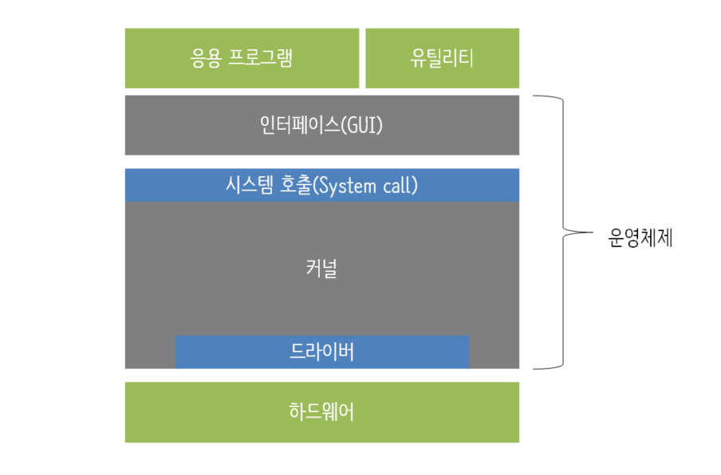
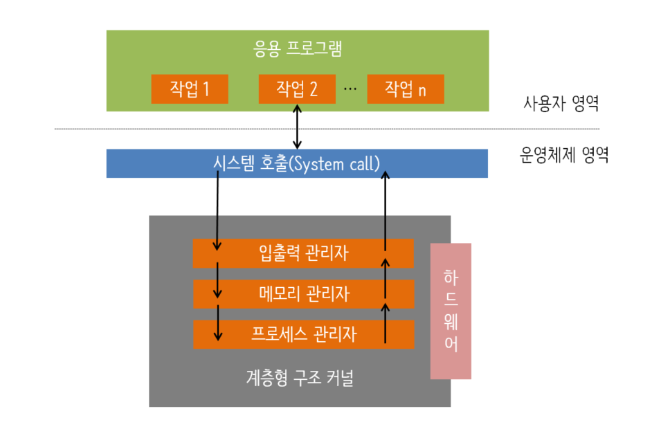
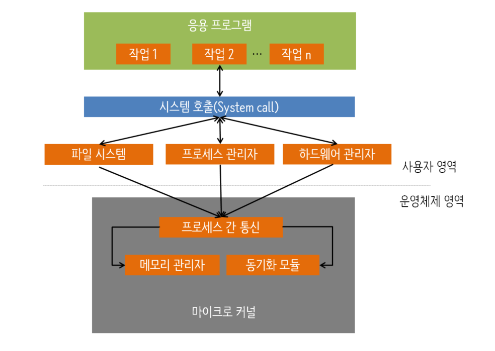

# 운영체제 구조

운영체제는 크게 인터페이스와 커널로 나뉜다.
- `인터페이스` 
  - 사용자와 응용 프로그램에 인접하여 커널에 명령을 전달하고 실행 결과를 사용자와 응용 프로그램에 돌려준다. 
  - ex) 유닉스 운영체제의 인터페이스는 셸(shell)이라고 한다.
- `커널` 
  - 운영체제의 핵심 기능(프로세스 관리, 메모리 관리, 저장장치 관리 등)을 모아 놓은 것으로, 자동차에 비유하면 엔진의 역할을 한다.

운영체제는 커널과 인터페이스를 분리하여 같은 커널을 사용하더라도 다른 인터페이스를 가진 형태로 제작할 수 있다. 

## 시스템 호출과 드라이버
### 시스템 호출(System call)
- 응용 프로그램과 커널의 인터페이스
- 커널은 사용자나 응용 프로그램으로부터 컴퓨터 자원을 보호하기 위해 자원에 직접 접근하는 것을 차단한다. 따라서 **자원을 이용하려면 시스템 호출(System call)이라는 인터페이스를 이용해 접근해야 한다.**
- 시스템 호출은 **커널이 제공하는 시스템 관련 서비스를 모아놓은 것으로 함수 형태로 제공**된다. 
   - `fork()` : 자식 프로세스의 생성
   - `exit()` : 현재 프로세스의 종료
   - `read()` : 파일 지정자로부터 읽기
   - `write()` : 파일 지정자로 쓰기
   - `open()` : 파일이나 장치 열기
   - `close()` : 파일 지정자 닫기

### 드라이버(Driver)
- 커널과 하드웨어의 인터페이스
- 하드웨어는 커널과 직접 연결되기도 하고 디바이스 드라이버를 통해 연결되기도 한다.
    - 마우스, 키보드 같이 복잡하지 않은 드라이버는 커널에 포함되어 있음
    - 그래픽카드, 프린터 같이 크기가 크고 복잡한 디바이스 드라이버는 사용자가 설치해야 함

> 디바이스 드라이버 : 하드웨어 제작자가 만든 소프트웨어 

## 커널
- `프로세스 관리` : 프로세스에 CPU를 배분하고 작업에 필요한 제반 환경을 제공한다.
- `메모리 관리` : 프로세스에 작업 공간을배치하고 실제 메모리보다 큰 가상공간을 제공한다.
- `파일 시스템 관리` : 데이터를 저장하고 접근할 수 있는 인터페이스를 제공한다.
- `입출력 관리` : 필요한 입력과 출력 서비스를 제공한다.
- `프로세스 간 통신` : 공동 작업을 위한 각 프로세스 간 통신 환경을 지원한다.

커널의 핵심 기능을 어떻게 구현하는가에 따라 `단일형 구조 커널`, `계층형 구조 커널`, `마이크로 구조 커널`로 구분된다.

### 1. 계층형 구조 커널
- 비슷한 기능을 가진 모듈을 묶어서 하나의 계층으로 만들고 계층 간의 통신을 통해 운영체제를 구현하는 방식이다.
- 버그나 오류가 발생했을 때 디버깅, 처리하기가 쉽다
  - 비슷한 기능을 모아 모듈화했기 때문
  - 계층형이기 때문에 전체 커널을 고치는 것이 아니라 해당 계층만 따로 수정하면 된다 
- ex) 마이크로소프트의 윈도우, 오늘날 운영체제의 대부분

### 2. 마이크로 구조 커널
- 계층형 구조 커널의 운영체제가 요구사항을 수용하기 위해 계속 계층과 기능을 추가하여 커널의 크기가 계속 커졌으며, 소스도 방대해져서 오류도 잡기 어려워졌다. 계층형 구조의 접근 방식과 반대로 개발된 커널이 마이크로 구조 커널이다.
- 프로세스 관리, 메모리 관리, 프로세스 간 통신 관리 등 가장 기본적인 기능만 제공한다. 

# 참고자료
- [쉽게 배우는 운영체제](http://www.yes24.com/Product/Goods/62054527)