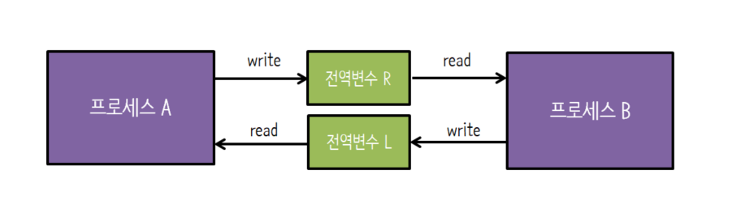
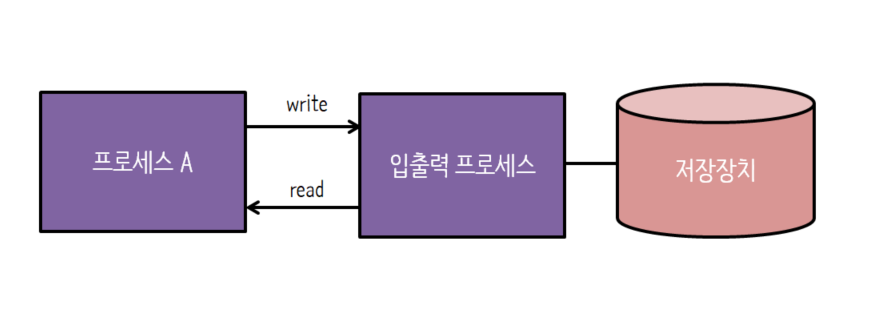
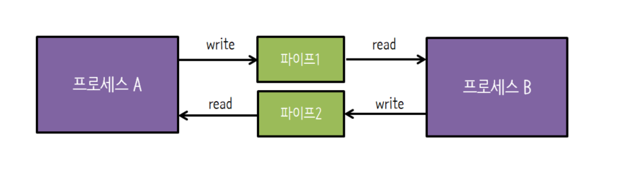
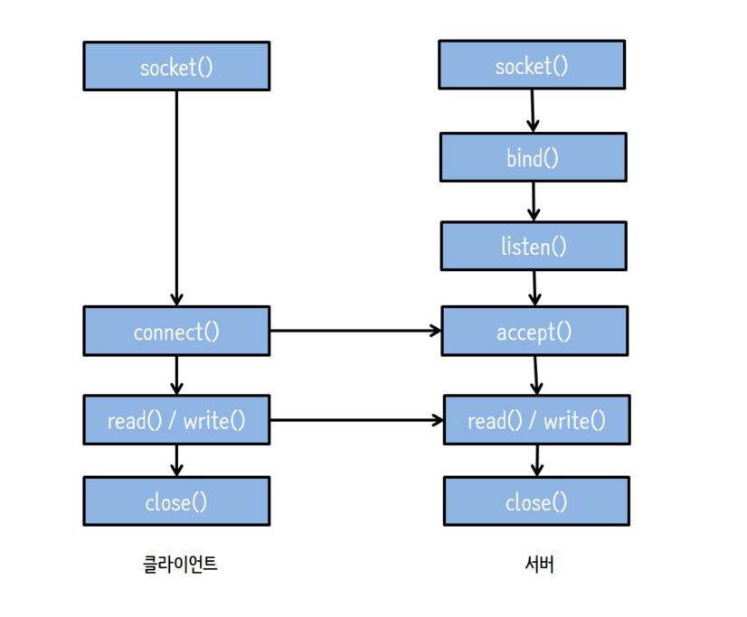

# 프로세스 간 통신(IPC)
프로세스는 시스템 내에 독립적으로 실행되기도 하고 다른 프로세스와 데이터를 주고받으며 협업하기도 한다. 
프로세스 간 통신 방식은 데이터를 주거나(send), 받는다(receive).
프로세스 간 통신의 종류로는 프로세스 내부 데이터 통신, 프로세스 간 데이터 통신, 네트워크를 이용한 데이터 통신이 있다. 

- 프로세스 내부 데이터 통신
    - 하나의 프로세스 내에 2개 이상의 스레드가 존재하는 경우의 통신
    - 전역 변수나 파일을 이용해 데이터 통신
- 프로세스 간 데이터 통신
    - 같은 컴퓨터에 있는 여러 프로세스끼리 통신하는 경우
    - 공용 파일 또는 운영체제가 제공하는 파이프를 사용해 데이터 통신
- 네트워크를 이용한 데이터 통신
    - 여러 컴퓨터가 네트워크로 연결되어 있을 때 데이터 통신
    - 소켓, RTC를 이용한 데이터 통신

> 소켓을 이용한 프로세스 간 통신 => 네트워킹            
> RTC : 다른 컴퓨터에 있는 함수를 호출하는 통신 방식

## 프로세스 간 통신의 분류

### 통신 방향에 따른 분류
**데이터가 전송되는 방향**에 따라 duplex, half-duplex, simplex 통신으로 구분된다.

- `양방향 통신(duplex communication)`
    - 데이터를 동시에 양쪽 방향으로 전송할 수 있음
    - ex) 소켓 통신
- `반양방향 통신(half-duplex communication)`
    - 데이터를 양쪽 방향으로 전송할 수 있지만, 동시 전송은 불가능
    - ex) 무전기
- `단방향 통신(simplex communication)`
    - 한쪽 방향으로만 데이터 전송 가능
    - ex) 전역 변수, 파이프

### 통신 구현 방식에 따른 분류
**동기화 기능이 있는지, 없는지**에 따라 bloking, non-blocking 통신으로 구분된다.

- `대기가 있는 통신(blocking communication)`
    - 동기화를 지원하는 통신 방식 => synchronous communication
    - 데이터를 받는 쪽은 데이터가 도착할 때까지 자동으로 대기 상태에 머물러 있음
    - ex) 파이프, 소켓
- `대기가 없는 통신(non-blocking communication)`
    - 동기화를 지원하지 않는 통신 방식 => asynchronous communication
    - 데이터를 받는 쪽은 busy waiting(바쁜 대기)를 사용하여 데이터가 도착했는지 여부를 직접 확인함
    - 통신 오버헤드는 적으나 busy waiting 등 사용자가 직접 처리해야 하는 작업이 많음
    - ex) 전역 변수, 파일

> `busy waiting(바쁜 대기)` : 상태 변화를 살펴보기 위해 반복문을 무한 실행하며 기다리는 것 


## 프로세스 간 통신의 종류

### 전역 변수
- 공동으로 관리하는 메모리를 사용해 데이터를 주고받는 것
- 데이터를 보내는 쪽에서 전역 변수에 값을 쓰고, 데이터를 받는 쪽에서는 값을 읽는다. 
- 직접적으로 관련이 있는 프로세스 간에 사용한다.
    - 부모 프로세스가 전역 변수를 선언한 후 자식 프로세스를 만들면 부모 프로세스와 자식 프로세스가 통신할 수 있다. 
- 운영체제가 프로세스 동기화를 제공하지 않는다.
- 단방향 통신




1. 프로세스 A가 전역 변수 R에 쓰기 연산을 한다.(write)
2. 프로세스 B가 그 데이터를 읽는다.(read)

프로세스 A가 1번의 과정을 언제 수행할지 프로세스 B는 모른다. 때문에 프로세스 B는 전역 변수 R을 계속 확인해야 한다. 즉, busy waiting을 하면서 전역 변수를 변화를 주시한다. 

### 파일
- 파일 입출력
    - 파일을 열고(open), 쓰기(write) 또는 읽기(read) 연산을 한 후, 파일을 닫는다.(close)
- 부모-자식 관계 프로세스 간 통신에 많이 사용된다.
- 운영체제가 프로세스 동기화를 제공하지 않는다.
    - 부모 프로세스가 wait() 함수를 이용해 자식 프로세스의 작업이 끝날 때까지 기다렸다가 작업을 시작한다.



```c
#include <stdio.h>
#include <unistd.h>
#include <fcntl.h>

int main() {
    int pid, fd;
    char buf[5];

    fd = open("com.txt", O_RDWR); 
    pid = fork();

    if (pid < 0 || fd < 0) exit(-1);
    else if (pid == 0) {
        write(fd, "Test", 5);
        close(fd);
        exit(0);
    } else {
        wait(0);
        lseek(fd, 0, SEEK_SET);
        read(fd, buf, 5);
        printf("%s", buf);
        close(fd);
        exit(0);
    }
}
```    


### 파이프

- 운영체제가 제공하는 동기화 통신 방식
- 단방향 통신
    - 파이프로 양방향 통신하려면 파이프 2개를 사용해야 한다.





```c
#include <stdio.h>
#include <unistd.h>

void main() {
    int pid, fd[2];
    char buf[5];

    if (pipe(fd) == -1) exit(-1);
    pid = fork();

    if (pid < 0) exit(-1);
    else if (pid == 0) {
        close(fd[0]);
        write(fd[1], "Test", 5);
        close(fd[1]);
        exit(0);
    }
    else {
        close(fd[1]);
        read(fd[0], buf, 5);
        close(fd[0]);
        printf("%s", buf);
        exit(0);
    }
}
```
- 이름 없는 파이프(anonymous pipe)
    - 일반적으로 파이프라고 하면 이름 없는 파이프를 가리킴.
    - 부모와 자식 프로세스 혹은 같은 부모를 가진 자식 프로세스와 같이 서로 관련 있는 프로세스 간 통신에 사용된다.
- 이름 있는 파이프(named pipe)
    - FIFO라 불리는 특수 파일을 이용하며 서로 관련 없는 프로세스 간 통신에 사용된다.

### 소켓
- 여러 컴퓨터에 있는 프로세스 간 통신 => 네트워킹
    - 네트워킹 상황에서의 통신은 RPC나 소켓을 이용한다.

다른 컴퓨터에 있는 프로세스와 통신을 하려면
1. 다른 컴퓨터의 위치를 파악한다. => `IP 주소`
2. 원격지의 시스템 내 여러 프로세스 중 어떤 프로세스와 통신을 할지 결정한다. => `포트 번호`




#### 클라이언트
- `socket()` : 소켓 생성
- `connect()` : 서버와의 접속 시도
- `read()` / `write()` : 읽고 쓰는 작업

#### 서버
- `socket()` 
- `bind()` : 특정 포트에 소켓을 등록
- `listen()` : 클라이언트를 받을 준비
- `accept()` : 클라이언트의 연결(connect) 요청을 수락
- `read()` / `write()` : 읽고 쓰는 작업


# 참고자료
- [쉽게 배우는 운영체제](http://www.yes24.com/Product/Goods/62054527)


