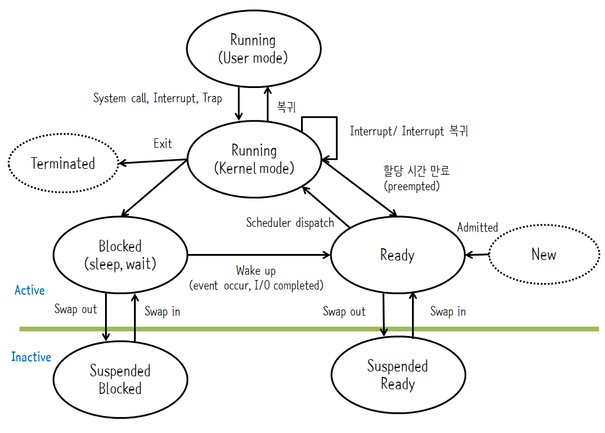
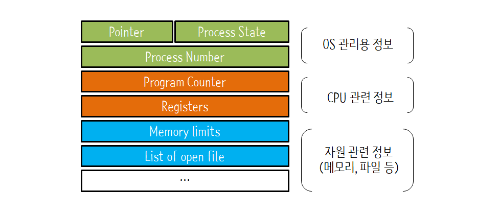
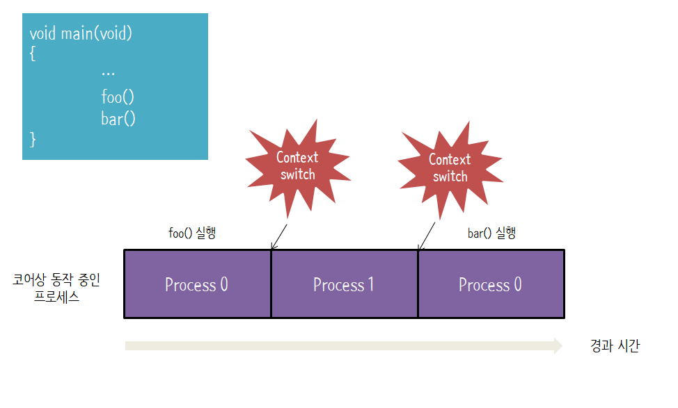
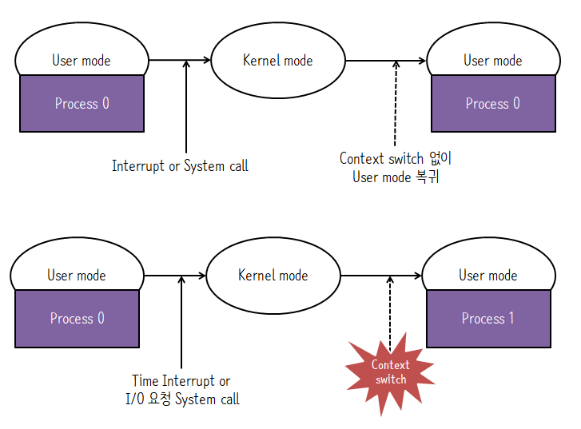

# 프로세스
- 프로세스는 **실행 중인 프로그램**이다.
  - `프로그램(Program)` : 저장장치(하드디스크 등)에 저장되어 있는 실행코드 (정적)
  - `프로세스(Process)` : 프로그램을 구동하여 프로그램 자체와 프로그램의 상태가 메모리 상에서 실행되는 작업 단위 (동적)

- `프로세스의 문맥(context)` : **CPU 수행 상태를 나타내는 하드웨어 문맥**이다.
  - 프로그램 카운터(Program counter)
  - 각종 레지스터(Register)

- 프로세스의 주소 공간은 `code`, `data`, `stack`으로 구성된다. 
  - code : 프로그램의 본문이 기술된 곳
  - data : 코드가 실행되면서 사용하는 변수나 파일 등의 각종 데이터를 모아놓은 곳
  - stack : 운영체제가 프로세스를 실행하기 위해 부수적으로 필요한 데이터를 모아놓은 곳

- 프로세스 관련 커널 자료구조는 PCB와 kernel stack이 있다.

## 프로세스 상태(Process State)

| 상태  | 내용  |
|---|---|
|Running   |CPU를 잡고 명령어를 수행중인 상태 |
|Ready   |CPU를 기다리는 상태 (메모리 등 다른 조건을 모두 만족하고) |
|Blocked (wait, sleep)   | I/O 등의 이벤트를 (스스로) 기다리는 상태  |
|Suspend (stopped)   | 외부적인 이유로 프로세스의 수행이 정지된 상태. 프로세스는 통째로 디스크에 swap out된다. |
|New   | 프로세스가 생성중인 상태  |
|Terminated |수행(execution)이 끝난 상태 |

> `swap out` : 메모리의 프로세스를 제거하고 디스크에 프로세스를 추가      
> `swap in` : 디스크의 프로세스를 제거하고 메모리에 프로세스를 로딩

> 프로세스가 배당된 작업 시간 : Time slice 또는 Time quantum

> ※ Suspend 상태가 되는 외부적인 이유?
> - 메모리가 꽉 차서 일부 프로세스를 메모리 밖으로 내보낼 때
> - 프로그램에 오류가 있어서 실행을 미뤄야 할 때
> - 바이러스와 같이 악의적인 공격을하는 프로세스라고 판단될 때
> - 매우 긴 주기로 반복되는 프로세스라 메모리 밖으로 쫓아내도 큰 문제가 없을 때
> - 입출력을 기다리는 프로세스의 입출력이 계속 지연될 때
> - 기타 등등

### Blocked와 Suspend의 차이
- Block : 자신이 요청한 이벤트가 만족되면 Ready
- Suspend : 외부에서 resume 해줘야 Active

## 프로세스 제어 블록(Process Control Block, PCB)
- 프로세스를 처리하는데 필요한 다양한 정보를 보관하는 자료구조
- 모든 프로세스는 고유의 프로세스 제어 블록을 가진다.
- 프로세스 제어 블록은 프로세스 생성시 만들어지고, 프로세스가 종료되면 메모리에서 삭제되고 프로세스 제어 블록도 폐기된다.
- 프로세스 제어 블록은 운영체제가 해당 프로세스를 위해 관리하는 데이터 구조이기 떄문에 운영체제 영역에 만들어진다.

1. OS가 관리상 사용하는 정보
    - Pointer : Ready 상태나 Blocked 상태는 큐로 운영되는데 PCB를 연결하여 이 상태의 큐를 구현할 때 포인터를 사용한다.
    - Process State : 프로세스가 현재 어떤 상태인지를 나타낸다.
    - Process Number : 운영체제 내에 있는 여러 프로세스를 구별하기 위한 구분자
    - Scheduling information, Priority 
2. CPU 관련 정보 
    - Program Counter : 다음에 실행될 명령어의 위치를 가리키는 PC 값을 저장한다
    - Registers : 프로세스가 실행되는 중에 사용하던 레지스터의 값이 저장된다.
3. 메모리 관련 정보 : CPU는 실행하려는 프로세스가 메모리의 어디에 저장되었는지 알아야 작업할 수 있다. 
    - 프로세스 메모리(code, data, stack)의 위치정보
4. 파일 관련 정보
    - open file descriptors

## 문맥 교환(Context Switch)
**CPU를 한 프로세스에서 다른 프로세스로 넘겨주는 과정**이다.

CPU가 다른 프로세스에게 넘어갈 때 운영체제는,
- CPU를 내어주는 프로세스의 상태를 해당 프로세스의 PCB에 저장한다.
- CPU를 새롭게 얻는 프로세스의 상태를 PCB에서 읽어온다.

main 코드가 실행될 때 보통 `foo()` 다음 `bar()`가 바로 실행될 것이라고 생각한다. **하지만 `foo()` 직후 `bar()`가 실행된다고 보장할 수 없다. `foo()` 실행 후 다른 프로세스로 context switch가 일어날 수 있기 때문이다.**

 

또 주의해야 할 점은 **시스템 콜이나 인터럽트 발생시 반드시 context switch가 일어나지는 않는다는 것이다.** context switch는 프로세스가 다른 프로세스로 넘겨줄 때 일어난다. **사용자 모드에서 커널 모드로, 커널 모드에서 사용자 모드로 바뀔 때 동일 프로세스가 CPU를 차지하고 있다면 이는 context switch가 일어난게 아니다.**

# 참고자료
- [KOCW 운영체제 강좌](http://www.kocw.net/home/search/kemView.do?kemId=1046323)
- [쉽게 배우는 운영체제](http://www.yes24.com/Product/Goods/62054527)